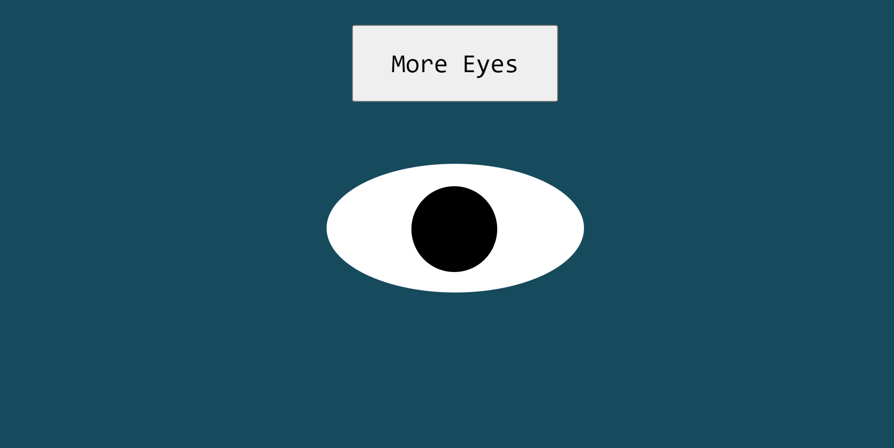

# Eyes: Stalker Edition

# Description

How many eyes does your mouse can handle? From the **MITxPro Full Stack Development** program I present to you the project "Eyes: Stalker Edition".This little program will let you create several eyes with a simple click on the button 'More Eyes'. This repository features the usage of JavaScript, manipulation of the DOM and CSS styling for looks and object placement. At the click, a new eye will be generated and placed next to the previous object. 

***How to run:*** Once the repository is deployed (https://dfgav1r1a.github.io/eyes-factory) you will find a page with one single eye. To start, generate as many objects as you would like to see by clicking the button "More Eyes". You will notice that each single eye *will follow the direction on which your mouse is moving*. If you use a tablet or a smartphone, the eyes will follow the place you tapped on the screen. No matter the resolution of your screen or the zoom, the eyes will be generated within the boundaries of the display. To clear restart, please press the key "F5" on your keyboard or reload the page using your browser.

## Improvement Roadmap

1. Add a remove button that will delete one object from the screen.
2. Add a restart button that will reset the environment instead of using the "F5" key on the keyboard.
3. Add an option where the user can decide upon the number of objects that would be added to the screen instead of clicking the button "More Eyes".
4. Add styling so every eye added gets smaller allowing more space for more eyes.
5. Add functionality so the user can decide on the looks of the eyes like size, color, etc.
6. To make this project more interesting: Add functionality so the user can add features like eye lashes, eye brows and place the eyes on a face.

# MIT License

Copyright (c) 2020

Permission is hereby granted, free of charge, to any person obtaining a copy
of this software and associated documentation files (the "Software"), to deal
in the Software without restriction, including without limitation the rights
to use, copy, modify, merge, publish, distribute, sublicense, and/or sell
copies of the Software, and to permit persons to whom the Software is
furnished to do so, subject to the following conditions:

The above copyright notice and this permission notice shall be included in all
copies or substantial portions of the Software.

THE SOFTWARE IS PROVIDED "AS IS", WITHOUT WARRANTY OF ANY KIND, EXPRESS OR
IMPLIED, INCLUDING BUT NOT LIMITED TO THE WARRANTIES OF MERCHANTABILITY,
FITNESS FOR A PARTICULAR PURPOSE AND NONINFRINGEMENT. IN NO EVENT SHALL THE
AUTHORS OR COPYRIGHT HOLDERS BE LIABLE FOR ANY CLAIM, DAMAGES OR OTHER
LIABILITY, WHETHER IN AN ACTION OF CONTRACT, TORT OR OTHERWISE, ARISING FROM,
OUT OF OR IN CONNECTION WITH THE SOFTWARE OR THE USE OR OTHER DEALINGS IN THE
SOFTWARE.
